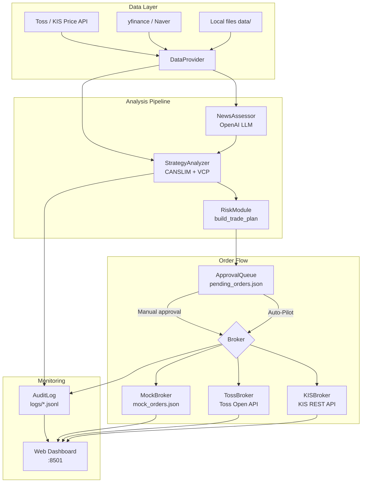
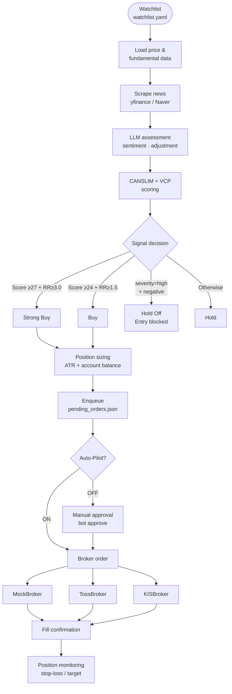
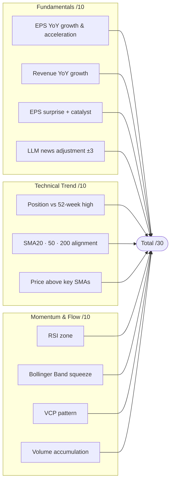

# AlphaBot — CANSLIM + VCP Automated Trading Bot

A semi-automated momentum trading bot for Korean and US equity markets.
Combines CANSLIM fundamentals, VCP (Volatility Contraction Pattern) technical analysis, and LLM-powered news assessment, with Toss Open API as the primary broker path and KIS retained as an optional legacy adapter.

---

## Key Features

| Feature | Description |
|---------|-------------|
| **CANSLIM + VCP Scoring** | Fundamentals (10) + Trend (10) + Momentum (10), max 30 points |
| **LLM News Assessment** | OpenAI GPT analyzes recent news → score ±3 adjustment; blocks entry on high-severity negatives |
| **ETF Proxy Fundamentals** | Leveraged ETFs (SOXL, TQQQ, etc.) derive fundamentals from top-holdings weighted average |
| **Auto Position Sizing** | Account balance × `risk_per_trade_pct` ÷ ATR-based stop distance |
| **Mock Simulator** | Paper-trade with a JSON-backed ledger — buy/sell/inject positions without real orders |
| **Toss Open API** | KR/US prices, accounts, holdings, direct orders, fill lookup, and conditional-order primitives; live orders are feature-gated off by default |
| **KIS REST API** | Optional legacy adapter for KR/US markets (paper and live modes) |
| **Web Dashboard** | Mission control UI on port 8501 — Auto-Pilot, Mock Sim, Portfolio, Account tabs |
| **Backtester** | Gap-aware exits, symmetric slippage, commission model, Sharpe ratio and MDD |
| **Structured Audit Logs** | JSONL format (`logs/activity_*.jsonl`, `logs/llm_*.jsonl`) |
| **Market Regime Filter** | CANSLIM "M" factor — blocks new buys when the broad index drops below its 200-day SMA |
| **Market Hours Gate** | Auto-pilot respects KR/US exchange schedules and holidays |

---

## Architecture



---

## Trade Decision Flow



---

## Scoring System



| Signal | Conditions |
|--------|------------|
| **Strong Buy** | Score ≥ 27 **and** R/R ≥ 3.0 |
| **Buy** | Score ≥ 24 **and** R/R ≥ 1.5 |
| **Hold Off** | LLM severity=high + sentiment=negative, or index below 200-SMA |
| **Wait** | Insufficient score or R/R |

> **High-conviction override:** Scores ≥ 27 relax the R/R minimum to 1.2:1; scores ≥ 29 relax to 1.0:1 — because structurally strong setups near resistance compress achievable R/R.

---

## Installation

### Requirements

- Python 3.11 – 3.13
- Toss Open API account with an allowed source IP (recommended), or KIS Open API for the legacy path
- OpenAI API key (optional — falls back to neutral news assessment if absent)

### Setup

```bash
# 1. Clone and install in editable mode
git clone <repo-url> && cd AI-TradingBot
python3 -m pip install -e .

# 2. Copy configuration templates
cp config.example.yaml config.yaml
cp watchlist.example.yaml watchlist.yaml

# 3. Create .env and keep Toss live ordering disabled initially
cp .env.example .env
# Fill TOSS_CLIENT_ID / TOSS_CLIENT_SECRET in .env
```

> [!CAUTION]
> Never commit `.env` or `config.yaml`. Keep `TOSS_ENABLE_LIVE_ORDERS=false` through read-only verification; the supplied Toss guide does not document a sandbox.

---

## CLI Usage

```bash
# ── Single-ticker analysis ──────────────────────────────────────
bot analyze --ticker NVDA --market US --toss-data # Toss adjusted daily prices
bot analyze --ticker NVDA --market US --demo      # Synthetic demo data
bot analyze --ticker 005930 --market KR --language ko
bot analyze --ticker SOXL --market US --no-llm    # Skip LLM news step

# ── Analyze + enqueue order ─────────────────────────────────────
bot analyze --ticker NVDA --market US --queue-order --quantity 5

# ── Watchlist scan (no LLM, quick overview) ─────────────────────
bot scan --universe watchlist.yaml

# ── Order management ────────────────────────────────────────────
bot pending                                       # List queued orders
bot approve --order-id <ORDER_ID> --broker mock   # Approve via mock
bot approve --order-id <ORDER_ID> --broker toss   # Toss (requires live-order gate)
bot approve --order-id <ORDER_ID> --broker kis    # Approve via KIS (live)

# ── Auto-pilot (fully automated loop) ──────────────────────────
bot auto --universe watchlist.yaml --broker mock --interval 300
bot auto --universe watchlist.yaml --broker toss --toss-data --auto-size --no-llm
bot auto --universe watchlist.yaml --broker kis --auto-size --no-llm

# ── Exit monitor + independent liveness watchdog ───────────────
bot monitor --broker toss --toss-data
# Run this in a separate service/terminal; Telegram credentials are optional.
bot watchdog --component auto --component monitor

# ── Backtesting ─────────────────────────────────────────────────
bot backtest --ticker NVDA --market US --demo

# ── GUI & Web ───────────────────────────────────────────────────
bot-gui                                           # Tkinter desktop GUI
python3 -m alpha_bot.web                          # Web dashboard (localhost:8501)
```

---

## Web Dashboard (`localhost:8501`)

```bash
python3 -m alpha_bot.web
```

| Tab | Description |
|-----|-------------|
| **Dashboard** | Portfolio overview, broker-separated P&L, recent orders |
| **Watchlist** | Batch quick-scan of the watchlist, refresh on demand |
| **Analysis** | Run a detailed single-ticker analysis |
| **Auto-Pilot** | Mission control — status dots, countdown timer, KPI cards, bot-held positions |
| **Mock Sim** | Manual buy/sell, position injection, cash setting, ledger reset |
| **Account** | Toss, KIS, or Mock balances and positions |

### Auto-Pilot Usage

1. **Save Settings** — Set interval, broker, risk parameters, then click Save
2. **Start** — Toggle "Start Auto-Trade" ON → countdown timer begins
3. **Live Feed** — Bot decisions (buy signal, reject, hold) appear in real-time
4. **Stop** — Toggle OFF → current cycle completes then stops

### Mock Simulator

| Action | Description |
|--------|-------------|
| **Manual Order** | Enter ticker, quantity, price, and direction → immediately reflected in ledger |
| **Inject Position** | Insert a pre-existing position (no cash deduction) |
| **Set Cash** | Change starting cash for simulation (KRW for KR, USD for US) |
| **Delete Order** | Remove a specific order ID from the ledger |
| **Reset** | Wipe the entire ledger (option to keep starting cash) |

---

## Data File Formats

To use local fixture data instead of live broker feeds:

```
data/
  prices/US_NVDA.csv
  fundamentals/US_NVDA.json
  news/US_NVDA.json
  contexts/US_NVDA.json
```

**Price CSV** (`date,open,high,low,close,volume`):
```csv
2026-01-02,100,105,99,104,1000000
```

**Fundamentals JSON**:
```json
[{"period":"2026Q1","eps_yoy":35.0,"revenue_yoy":28.0,"eps_surprise":4.2}]
```

**News JSON**:
```json
[{"headline":"New catalyst","summary":"…","source":"manual","published_at":"2026-05-01"}]
```

**Context JSON**:
```json
{
  "benchmark_return_3m": 4.0,
  "stock_return_3m": 12.5,
  "sector_theme": "AI semiconductors",
  "foreign_flow": "positive"
}
```

---

## Configuration (`config.yaml`)

```yaml
default_market: US          # US | KR
broker: mock                # mock | toss | kis
data_dir: data
approval_queue: pending_orders.json
max_positions: 5            # Max concurrent held positions
risk_per_trade_pct: 1.0     # % of account value risked per trade
min_score: 24               # Minimum score for Buy signal
min_rr: 1.5                 # Minimum risk/reward ratio
```

---

## Project Structure

```
src/alpha_bot/
├── models.py            Core dataclasses (Candle, OrderRequest, TradePlan, …)
├── config.py            config.yaml + .env loader (no PyYAML dependency)
├── runner.py            CLI entry point (bot commands)
├── risk.py              ATR-based stop-loss, target calculation
├── backtest.py          Walk-forward backtester (gap-aware, Sharpe, MDD)
├── market_regime.py     Market-wide regime filter, 6h cache
├── market_hours.py      KR/US exchange schedule + holiday gate
├── audit_log.py         Thread-safe JSONL audit logging
├── daily_report.py      Daily activity aggregation from audit logs
├── errors.py            Exception hierarchy (BotError → Data/Strategy/Broker/Approval)
├── utils.py             Shared helpers (market validation, exchange code inference)
├── gui.py               Tkinter desktop GUI launcher
├── auto/                Auto-Pilot pipeline
│   ├── analysis.py      One-shot analysis + provider/broker factories
│   ├── orchestrator.py  Watchlist scan loop, cooldown, regime gate
│   ├── position_manager.py  Stop/target monitoring, reconciliation, force-exit
│   ├── watchdog.py      Atomic heartbeats + out-of-process stale-process alerts
│   └── sizing.py        ATR-based position sizing from account balance
├── web/                 Web dashboard (port 8501, stdlib http.server)
│   ├── server.py        DashboardHandler routing + entry point
│   ├── autopilot_state.py  Thread-safe auto-pilot state + background loop
│   ├── handlers_analysis.py  Analyze, scan, backtest, queue endpoints
│   ├── handlers_orders.py    Order list, approve, sync endpoints
│   ├── handlers_portfolio.py Portfolio, bot holdings, bot stats endpoints
│   ├── handlers_mock.py      Mock broker simulation endpoints
│   └── handlers_config.py    Settings, watchlist, account, logs, FX endpoints
├── strategy/
│   ├── analyzer.py      StrategyAnalyzer — CANSLIM + VCP scoring engine
│   └── indicators.py    Pure functions: SMA, RSI, ATR, Bollinger, VCP detection
├── data/
│   ├── providers.py     DataProvider protocol + Fixture/Synthetic/Toss/KIS implementations
│   ├── fundamentals.py  Fundamental data loader + ETF proxy aggregation
│   ├── scraper.py       News scraper (yfinance for US, Naver for KR)
│   └── quotes.py        Real-time quote fetcher for portfolio display
├── news/
│   └── assessor.py      LLM news assessment (OpenAI structured JSON mode)
├── broker/
│   ├── base.py          Broker protocol (structural typing)
│   ├── mock.py          MockBroker — JSON ledger-based simulator
│   ├── toss.py          TossBroker — Toss Open API adapter (KR + US)
│   └── kis.py           KISBroker — legacy KIS REST adapter (KR + US)
├── approval/
│   └── queue.py         ApprovalQueue — pending_orders.json lifecycle manager
├── report/
│   └── markdown.py      Analysis report Markdown renderer (EN/KO)
└── static/
    └── dashboard.html   Single-page web dashboard frontend

tests/
├── factories.py         Shared test fixtures (demo candles, fundamentals)
├── test_risk.py          Stop-loss/target/R:R calculation tests
├── test_indicators.py    SMA, RSI, Bollinger, VCP indicator tests
├── test_strategy_rules.py Signal decision logic tests
├── test_news_assessment.py LLM assessment parsing + fallback tests
├── test_backtest.py      Backtester output validation
└── test_approval_broker.py Enqueue → approve → broker integration test
```

---

## Development & Testing

```bash
# Run all tests
python3 -m unittest discover -s tests

# Run specific test file
python3 -m pytest tests/test_indicators.py -v
python3 -m pytest tests/test_backtest.py -v

# Quick demo analysis (no API keys needed)
bot analyze --ticker NVDA --market US --demo --no-llm
```

---

## Safety Guidelines

- **Toss:** start with `TOSS_ENABLE_LIVE_ORDERS=false`; verify read-only account, holdings, prices and account selection first
- The supplied Toss specification does not expose a sandbox, so any tiny live acceptance order requires separate operator approval
- Run `bot monitor` independently from `bot auto`, then run `bot watchdog` in a third service/process. The watchdog alerts on stale heartbeats but deliberately does not liquidate positions automatically
- Configure `TELEGRAM_BOT_TOKEN` and `TELEGRAM_CHAT_ID` to receive watchdog and risk alerts; heartbeat files are private local runtime state
- **KIS:** start with `KIS_MODE=paper` before its live mode
- Before running Auto-Pilot, double-check `max_positions` and `risk_per_trade_pct` in your config
- **Never commit** `.env` or `config.yaml` to a public repository
- The bot includes multiple safety gates: market hours check, regime filter, cooldown, cash pre-flight, and position limits

---

## Disclaimer

This software is provided for **educational and research purposes only**. The authors assume no responsibility for any financial losses incurred from using this bot for actual trading. All investment decisions are made at your own risk and discretion.
